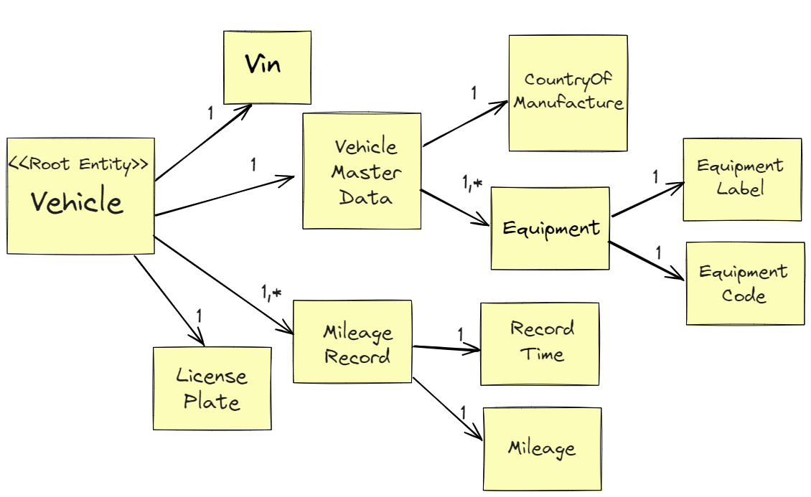

# Aufgabe 1 Domänenmodell Vehicle

## Lernziele

- Stereotyp Value Object verstehen und anwenden können
- Stereotyp Root Entity verstehen und anwenden können
- Fundament des Entities Ring / Domain Hexagon verstehen

## Aufgabe 1.1 Grundstruktur Root Entity Vehicle
- Implementiere das Domänenmodell der Root Entity Vehicle wie dargestellt auf Folie 38 / Seite 35 im PDF 
- Erstelle das Package <i>vehicle.domain.model</i> und lege die Domänenobjekte in diesem Package ab
- Implementiere die im folgenden aufgeführten Validierungsregeln in den betroffenen Domänenobjekten

 
 Abb 1: Vehicle Domain Model

| Domänenobjekt               | Validierungsregel                                                                   |
|-----------------------------|-------------------------------------------------------------------------------------|
| Vehicle                     | Die Eigenschaften Vin, LicensePlate und MileageRecords müssen immer vorhanden sein. |
| VIN                         | Ein valider Wert muss dem vorgesehenen Pattern folgen.                              |
| LicensePlate                | Ein valider Wert muss dem vorgesehenen Pattern folgen.                              |
| Mileage                     | Der Kilometerstand muss größer 0 sein.                                              |
| CountryOfManufacture        | Ein valider Wert muss dem vorgesehenen Pattern folgen.                              |
| Alle anderen Domänenobjekte | Kein Nullwerte, keine leeren oder blank Strings.                                    |


### Regex Pattern für das Value Object Vin

Beispiele:

* WP0ZZZ99ZTS392155
* WBAOLZ99ZTS349156

 ```java
 "(?=.*\\d|=.*[A-Z])(?=.*[A-Z])[A-Z0-9]{17}"
 ```
   
### Regex Pattern für das Value Object LicensePlate
   
Beispiele:
* B-AB 123 
* ES-CD 456

```java
"^[A-Z0-9]{1,7}$"
```

### Regex Pattern für das Value Object CountryOfManufacture

Beispiele:
* US 
* DE

```java
"^[A-Z]{2}$"
```

## Aufgabe 1.2 Rich Domain Model - Verhalten am Domänenobjekt

Implementiere die Aktualisierung des Kilometerstandes (Mileage) mit Plausibilitätsprüfung.

### Plausibilitätsprüfung für den Kilometerstand

```java
mew milegae > previous mileage
```

## Beispiel-Test für Vin

```java
class VinTest {

    private final static List<String> VALID_VIN_LIST = Arrays.asList(
            "KMHDU4ADXAU832403", //2010 Hyundai Elantra
            "1GCHC33N7RJ376544", //1994 Chevrolet C/K 3500
            "2S3TD52V3Y6103456", //2000 Suzuki Esteem
            "1G1ZT51816F264066", //2006 Chevrolet Malibu
            "1GBJK34G32E254979" //2002 Chevrolet Silverado 3500
    );

    private final static List<String> INVALID_VIN_LIST = Arrays.asList(
            null,
            "",
            " ",
            "K 234 Lm",
            "123445667",
            "WERTTZUUKHGH"
    );

    @Test
    void shouldCreateValidVinValueObject() {
        VALID_VIN_LIST.forEach(vin -> assertDoesNotThrow(() -> new Vin(vin)));
    }

    @Test
    void shouldThrowIllegalArgumentExceptionDueToInvalidVinValue() {
        INVALID_VIN_LIST.forEach(vin -> assertThrows(IllegalArgumentException.class, () -> new Vin(vin)));
    }
}
```
