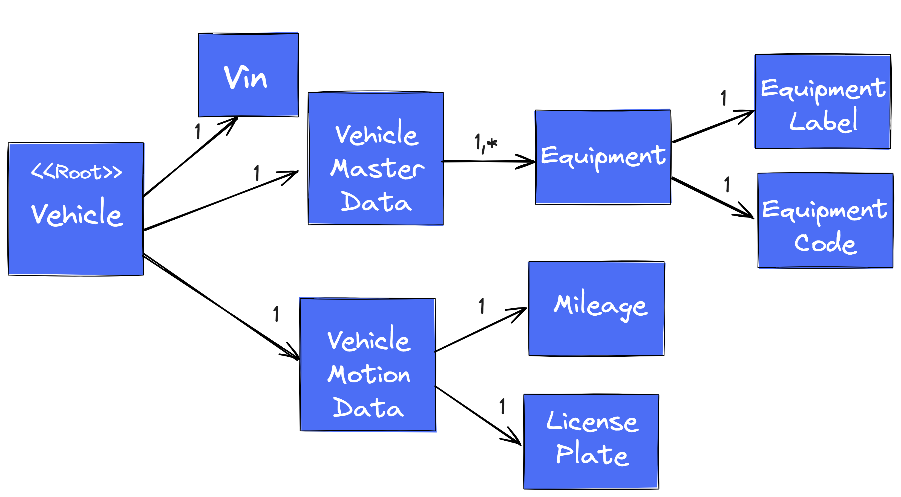

# Entities und Use Cases


## Aufgabe 1 Domänenmodell Vehicle

Implementiere das dargestellte Domänenmodell


Abb 1: Vehicle Domain Model
- 
- Vehicle</i> ist die Root Entity des Domänenmodell</i>.</li>
    <li>Implementiere die untergeordneten Domänenobjekte als <i>Value Object</i></li>
   <li>Erstelle das Package <i>vehicle.domain.model</i> und lege die Domänenobjekte in diesem Package ab</li>
   <li>Implementiere die im folgenden aufgeführten Validierungsregeln in den betroffenen Domänenobjekte</li>

<details>
  <summary>Coding Task 1</summary>

<b>Domänenmodell Vehicle</b>
<br/>
<ol>
   <li>Implementiere das dargestellte Domänenmodell <i>Vehicle</i></li>
   <li><i>Vehicle</i> ist die Root Entity des Domänenmodell</i>.</li>
    <li>Implementiere die untergeordneten Domänenobjekte als <i>Value Object</i></li>
   <li>Erstelle das Package <i>vehicle.domain.model</i> und lege die Domänenobjekte in diesem Package ab</li>
   <li>Implementiere die im folgenden aufgeführten Validierungsregeln in den betroffenen Domänenobjekte</li>
</ol>

   <table>
       <tr>
           <th>Domain Object</th>
           <th>Validation Rule</th>
       </tr>
       <tr>
           <td>Vehicle</td>
           <td>Alle Eigenschaften müssen vorhanden und für sich valide sein.</td>
       </tr>
       <tr>
           <td>VIN</td>
           <td>Ein valider Wert muss dem Vin-Regex-Pattern folgen.</td>
       </tr>
       <tr>
           <td>LicensePlate</td>
           <td>Ein valider Wert muss dem LicensePlate-Regex-Pattern folgen.</td>
       </tr>
       <tr>
           <td>Mileage</td>
           <td>Der Kilometerstand muss größer 0 sein.</td>
       </tr>
       <tr>
           <td>EquipmentCode</td>
           <td>Ein valider Wert muss dem EquipmentCode-Regex-Pattern folgen.</td>
       </tr>
       <tr>
           <td>Alle anderen Domänenobjekte</td>
           <td>Kein Nullwerte, keine leeren oder blank Strings</td>
       </tr>
   </table>
</details>

   <details>
     <summary>Vin-Regex-Pattern</summary>
   
   ```java
   
   // examples
   // WP0ZZZ99ZTS392155
   // WBAOLZ99ZTS349156
   
   "(?=.*\\d|=.*[A-Z])(?=.*[A-Z])[A-Z0-9]{17}"
   
   ```
   </details>

   <details>
     <summary>LicensePlate-Regex-Pattern</summary>
   
   ```java
    "[A-ZÖÜÄ0-9]{1,5}[-]{0,1}[A-ZÖÜÄ0-9]{0,10}[-]{0,1}[A-ZÖÜÄ0-9]{0,4}""[A-ZÖÜÄ0-9]{1,5}[-]{0,1}[A-ZÖÜÄ0-9]{0,10}[-]{0,1}[A-ZÖÜÄ0-9]{0,4}"  
   ```
   </details>

   <details>
     <summary>EquipmentCode-Regex-Pattern</summary>

   ```java
   
   // examples
   // WP0ZZZ99ZTS392155
   // WBAOLZ99ZTS349156
   
   "(?=.*\d|=.*[A-Z])(?=.*[A-Z])[A-Z0-9]{17}"
   
   ```
   </details>

<details>
  <summary>Tests Coding Task 1</summary>
   <b>RUN</b> DomainEntityTest
   <br/>
   <b>RUN</b> CleanArchitectureFitnessFunction
</details>


## Domain Service und Use Cases

<details>
   <summary>Coding Task 2</summary>
   <b>Erstelle die ein- und ausgehenden Use Cases sowie den Use-Case-Connector (Stereotype Service)</b>
   <br/>
   <ol>
      <li>Erstelle das Package <i>domain.service</i> als Subpackage von <i>vehicle</i> und erstelle die Klasse <i>VehicleService</i> </li>
      <li>Erstelle die Packages <i>usecase.in</i> und <i>usecase.out</i> als Subpackages von <i>vehicle</i></li>
      <li>Erstelle den eingehenden Use Case <i>VehicleCommand</i> im dafür vorgesehenen Package mit der Schnittstelle <i>createVehicle</i></li>
      <li>Erstelle die ausgehenden Use Cases <i>VehicleRepository</i> und <i>FetchVehicleMasterData</i> im dafür vorgesehenen Package mit den dafür vorgesehenen Schnittstellen</li>
      <li>Implementiere den Anwendungsfall <i>createVehicle</i> im <i>VehicleService</i></li>
   </ol>

   </details>
   
   <details>
      <summary>Schnittstelle VehicleCommand</summary>

   ```java
   Vehicle createVehicle(Vin vin, VehicleMotionData vehicleMotionData);
   ```
   </details>

   <details>
      <summary>Schnittstelle VehicleRepository</summary>

   ```java
   Vehicle save(Vehicle vehicle);
   ```
   </details>

   <details>
      <summary>Schnittstelle FetchVehicleMasterData</summary>

   ```java
   VehicleMasterData fetch(Vin vin);
   ```
   </details>

<details>
  <summary>Tests Coding Task 2</summary>
   <b>RUN</b> UseCaseConnectorTest
   <br/>
   <b>RUN</b> CleanArchitectureFitnessFunction
</details>